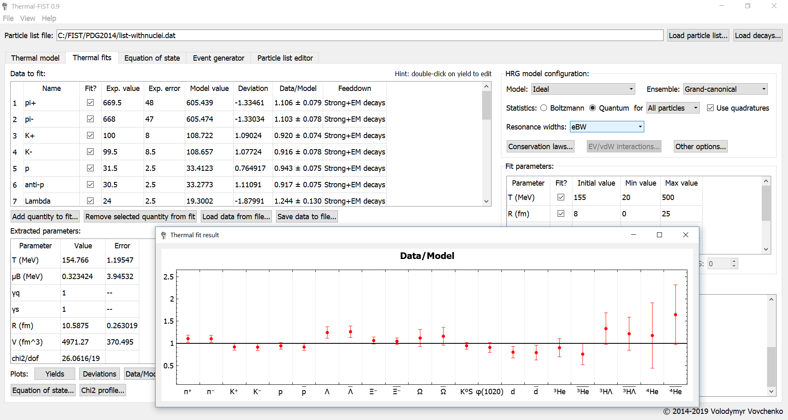

# Thermal-FIST

**Thermal-FIST** (or simply **The FIST**) is a C++ package designed for a convenient general-purpose analysis within the family of the hadron resonance gas (HRG) models.
This mainly includes the statistical analysis of particle production in heavy-ion collisions and the phenomenology of the hadronic equation of state. 

Particular emphasis is put on fluctuations and correlations of conserved charges, effects of probabilistic decays, chemical non-equilibrium, and inclusion of hadronic interactions.

Calculations are possible within the grand canonical ensemble, the canonical ensemble, as well as in mixed-canonical ensembles combining canonical treatment of strangeness/charm with the grand-canonical treatment of other conserved numbers.

For the grand canonical formulation it possible to include the effects of multi-component repulsive (excluded volumes) and/or attractive (mean-field) interactions between hadrons in the framework of the quantum van der Waals model.

The package contains a fast thermal event generator, with Blast Wave model based momentum distributions, and possibility of simultaneous inclusion of effects of exact charge conservation and hadronic interactions.

The package also includes **QtThermalFIST** -- a Qt-based graphical user interface frontend designed for a fast and convenient general-purpose thermal model analysis. Typical tasks, such as calculating
the equation of state properties or performing the thermal fits,
can be done in GUI. Using the GUI can therefore be a good starting point.
Please see the [**Quick Start Guide**](docs/quickstart.md) to get started.

For more details please see [**Thermal-FIST documentation**](https://fias.uni-frankfurt.de/~vovchenko/project/thermal-fist/doc/)

  

### Notes
Calculations may break down for excessive/overstressed parameters.
This should be carefully monitored.

### Third-party code used

- [**Eigen**](http://eigen.tuxfamily.org) C++ template library for linear algebra. ([MPL2](http://www.mozilla.org/MPL/2.0))
- [**MINUIT2**](http://seal.web.cern.ch/seal/snapshot/work-packages/mathlibs/minuit/) function minimization package from CERN-ROOT toolkit ([LGPL2.1](https://root.cern/license))
- [**Mersenne Twister**](http://www.math.sci.hiroshima-u.ac.jp/~m-mat/MT/emt.html) random number generator by M. Matsutomo and T. Nishimura ([implementation](http://www.math.sci.hiroshima-u.ac.jp/~m-mat/MT/VERSIONS/C-LANG/MersenneTwister.h) by R. J. Wagner)
- [**Qt5 framework**](https://www.qt.io) for the GUI frontend ([LGPL3](http://doc.qt.io/qt-5/lgpl.html))
- [**QCustomPlot**](https://www.qcustomplot.com/) Qt C++ widget for plotting and data visualzation by Emanuel Eichhammer ([GPL](https://www.gnu.org/licenses/gpl.html))

*Copyright (C) 2018-2019  Volodymyr Vovchenko*
