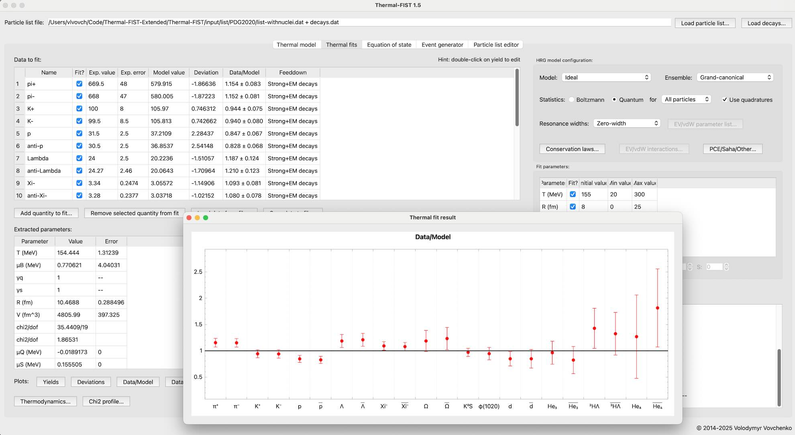

# Thermal-FIST

**Thermal-FIST** (or simply **The FIST**) is a C++ package designed for a convenient general-purpose analysis within the family of hadron resonance gas (HRG) models.
This mainly includes statistical analysis of particle production in heavy-ion collisions and phenomenology of the equation of state of hadronic matter.

### Main Features
- HRG equation of state and related properties
  - Thermodynamics
  - Susceptibilities
  - Speed of sound and heat capacity
  - Hadron yields
  - Fluctuations and correlations
  - Statisical ensembles
    - Grand-canonical
    - Canonical
    - Mixed-canonical

- Extensions of the standard (ideal) HRG model
  - Finite resonance widths
  - Repulsive interactions
    - van der Waals
    - Generalized excluded volume (Carnahan-Starling etc.)
    - Multi-component
  - Mean-field interactions
    - van der Waals and beyond
    - vector density functional
  - Partial chemical equilibrium
  - Fluctuations and correlations of both conserved (charges) and non-conserved (hadron numbers) quantities

- Heavy-ion applications
  - Thermal fits
  - Small systems and canonical effects
  - Light nuclei
  - Chemical non-equilibrium
  - Partial chemical equilibrium
    - Saha equation for light nuclei
    - Baryon annihilation
  - Monte Carlo event generator
    - Blast-Wave, Cracow, Siemens-Rasmussen models
    - Based on hydrodynamics hypersurface
    - Canonical ensemble and hard-core repulsion

- Other applications
  - Neutron star matter equation of state
  - Early Universe (cosmic trajectories)

- Graphical User Interface (QtThermalFIST)

### QtThermalFIST

The package includes **QtThermalFIST** -- a Qt-based graphical user interface frontend designed for a fast and convenient general-purpose thermal model analysis. Typical tasks, such as calculating
the equation of state properties or performing the thermal fits,
can be done in GUI. Using the GUI can therefore be a good starting point.

  

### Usage

Thermal-FIST is a C++ package, and can be used in C++ code. Common usage patters include:

- C++ macro using linking to the Thermal-FIST library. See [src/examples](src/examples) for illustration.
- As a submodule. See [https://github.com/vlvovch/finite-resonance-widths](https://github.com/vlvovch/finite-resonance-widths) for an example.
- As an event generator. See [https://github.com/vlvovch/fist-sampler](https://github.com/vlvovch/fist-sampler) for an example.
- Using graphical user interface.
- As a Jupyter notebook. See [https://github.com/vlvovch/fist-jupyter](https://github.com/vlvovch/fist-jupyter) for an example. (NOTE: does not work on Apple Silicon)

Please see the [**Quick Start Guide**](docs/quickstart.md) to get started as well as [the examples](https://vovchenko.net/project/thermal-fist/doc/examples.html) in [src/examples](src/examples) for illustration.

For running Thermal-FIST in the cloud, you may use [GitHub Codespaces](https://github.com/features/codespaces). It may even possible to run the GUI from a browser, see [https://github.com/devcontainers/features/tree/main/src/desktop-lite](https://github.com/devcontainers/features/tree/main/src/desktop-lite)

### Documentation

Please see the [**Thermal-FIST documentation**](https://fias.uni-frankfurt.de/~vovchenko/project/thermal-fist/doc/)

### Notes

- It is recommended to use the latest version of the package. See the [CHANGELOG](CHANGELOG.md)
- Undocumented new features and bugfixes often first appear in the [devel branch](https://github.com/vlvovch/Thermal-FIST/tree/devel)
- Open an issue if you have possible improvements/new features/bugfixes in mind
- Calculations may break down for excessive/overstressed parameters.
This should be carefully monitored, and the accuracy of the output assessed.
If in doubt, contact the program author(s).

### Third-party code used

- [**Eigen**](http://eigen.tuxfamily.org) C++ template library for linear algebra ([MPL2](http://www.mozilla.org/MPL/2.0)). Tested with version 3.4.0
- [**MINUIT2**](http://seal.web.cern.ch/seal/snapshot/work-packages/mathlibs/minuit/) function minimization package from CERN-ROOT toolkit ([LGPL2.1](https://root.cern/license))
- [**Mersenne Twister**](http://www.math.sci.hiroshima-u.ac.jp/~m-mat/MT/emt.html) random number generator by M. Matsutomo and T. Nishimura ([implementation](http://www.math.sci.hiroshima-u.ac.jp/~m-mat/MT/VERSIONS/C-LANG/MersenneTwister.h) by R. J. Wagner), slightly adapted to make it compatible with C++17.
- [**Qt6 or Qt5 framework**](https://www.qt.io) for the GUI frontend ([LGPL3](http://doc.qt.io/qt-5/lgpl.html))
- [**QCustomPlot**](https://www.qcustomplot.com/) Qt C++ widget for plotting and data visualization by Emanuel Eichhammer ([GPL](https://www.gnu.org/licenses/gpl.html))

## Attribution
Please cite the following paper when using this code:

- V. Vovchenko, H. Stoecker, *Thermal-FIST: A package for heavy-ion collisions and hadronic equation of state*, [Comput. Phys. Commun. **244**, 295 (2019)](https://doi.org/10.1016/j.cpc.2019.06.024), [arXiv:1901.05249 [nucl-th]](https://arxiv.org/abs/1901.05249)

Other citations may be needed depending on the specific features and inputs used.

It is expected that changes to the code are documented.

*Copyright (C) 2018-2025  Volodymyr Vovchenko*
